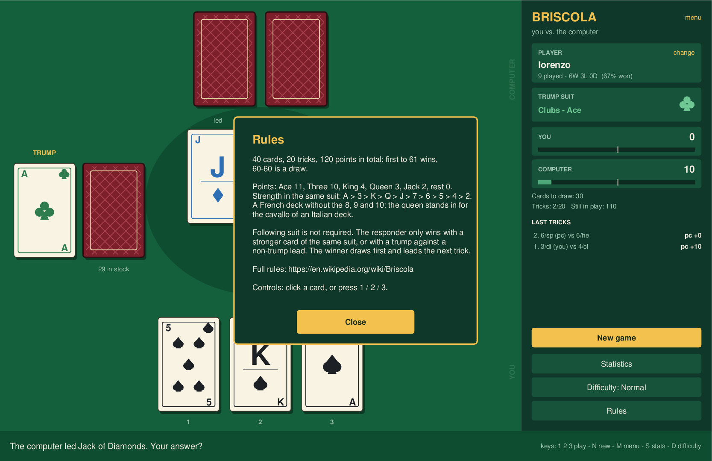

# Briscola

Two-player [Briscola](https://en.wikipedia.org/wiki/Briscola) — you against the
computer — with a Tkinter interface. Every card is drawn by the code, so there
are no image assets to install, and the whole window lives on a single Canvas.


## Contents

- [Install and run](#install-and-run)
- [The opening menu](#the-opening-menu)
- [How to play](#how-to-play)
- [Pacing and performance](#pacing-and-performance)
- [Rules implemented](#rules-implemented)
- [Difficulty levels](#difficulty-levels)
- [Match records](#match-records)
- [The cards](#the-cards)
- [Project layout](#project-layout)
- [Tests](#tests)
- [Screenshots](#screenshots)
- [Ideas for later](#ideas-for-later)

## Install and run

The project runs in its own conda environment named `briscola`, not in the base
environment:

```bash
conda env create -f environment.yml
```

Then start a game:

```bash
conda run -n briscola python main.py
```

Nothing outside the standard library is required — only Python 3.10+ (for the
`X | None` type syntax) and Tk, both provided by the environment file.

## The opening menu

The app opens on a menu: pick the player the results are filed under, choose
the difficulty, and start. `Statistics` and `Rules` are reachable from here
too, and the `menu` link at the top of the side panel brings you back during a
game (an abandoned game is not recorded).


## How to play

The layout, clockwise from the top: the computer's three face-down cards, the
face-up trump card and the stock on the left, the two cards of the current
trick in the middle, and your hand at the bottom. The right-hand panel keeps
the running score, the cards still to draw and a log of the last tricks; the
strip at the bottom always says whose turn it is and what just happened.

| Action | How |
| --- | --- |
| Play a card | Click it, or press `1`, `2`, `3` |
| Carry on through a pause | Click anywhere, or press space — see below |
| New game | `New game` button, or `N` — the opening lead alternates each game |
| Back to the menu | `menu` link in the panel header, or `M` |
| Statistics | `Statistics` button, or `S` |
| Change difficulty | `Difficulty` button, or `D` — cycles Easy → Normal → Expert |
| Rules reminder | `Rules` button, or `R` |
| Change player name | `change` link in the player box |

Hovering a card lifts it; the gold frame marks the card that wins a trick.

## Pacing and performance

The game deliberately pauses twice per trick — before the computer plays, and
again on the finished trick so you can see what it won — because otherwise
cards appear and vanish faster than you can read them. Those pauses are the
only thing that ever makes the game feel like it is waiting, and **clicking the
table or pressing space carries on immediately**, so the rhythm is yours: 550 ms
and 1000 ms if you let them run, nothing if you don't. During your own turn a
click on a card only ever plays that card — it never doubles as "carry on".

Which card a click and the hover lift refer to is worked out from the pointer
position against the fixed slot geometry, never from where the card image
currently sits. That matters more than it sounds: the obvious implementation,
Tk's per-item `<Enter>`/`<Leave>`, deadlocked the window. Lifting a card moved
it out from under a pointer resting near its bottom edge, Tk sent `<Leave>`,
the card dropped back under the pointer, `<Enter>` fired, and the two chased
each other at full CPU while real clicks were never processed — the window
stayed on screen and stopped responding. `tests/test_gui.py` guards both halves
of that: an idle window with the pointer resting on a card must cost almost no
CPU, and the click after a five-second pause must still land.

Messages (the rules, the result of a game) are drawn inside the window rather
than in native dialogs, which on macOS can open behind the main window and look
exactly like a frozen game:



The work behind a move is small. Measured on an Apple M2, per decision:

| Level | Mean | Worst |
| --- | --- | --- |
| Easy, Normal | under 1 ms | under 1 ms |
| Expert | ~103 ms | ~122 ms |

Easy and Normal are pure heuristics, so they answer instantly. Expert searches,
and that search runs in the interface thread — so it is capped by a wall-clock
budget (`ai.TIME_BUDGET`, 120 ms) as well as by a number of sampled worlds,
whichever ends first. That bound is what keeps the window responsive; on a
slower machine the search simply samples fewer worlds instead of freezing for
longer. Lower `TIME_BUDGET` if you want it snappier still, raise it for a
slightly sharper opponent.

Nothing runs between moves: sitting on the menu or waiting for your card, the
process measures **0.1% CPU and about 69 MB resident** (`ps` against a running
`main.py`) — that is the Python and Tk runtime, not the game.

If the interface ever does misbehave, run it with `BRISCOLA_DEBUG=1` and it
traces every turn, click, timer and opponent decision to stdout:

```bash
BRISCOLA_DEBUG=1 conda run -n briscola python main.py
```

```
[  40.325] play card 2: state=human overlay=False
[  40.335] computer to play in 550 ms
[  40.886] computer chose in 0 ms (normal)
[  40.904] trick complete, resolving in 1000 ms
[  41.905] resolving the trick
```

A trace like that says exactly where the game stopped, which is how the freeze
described above was found: the last line before it went quiet was the game
waiting for a card, and no click was ever logged after it. Exceptions inside a
callback are printed too, and shown in the status bar rather than swallowed.

## Rules implemented

Straight from the [Wikipedia rules](https://en.wikipedia.org/wiki/Briscola):

- 40 cards, 20 tricks, 120 points in total. **61 points win**, and 60–60 is a
  draw. The deck is a French one with the 8s, 9s and 10s removed, which is how
  Briscola is often played in Italy: the remaining 40 cards match an Italian
  deck one for one, with the queen standing in for the cavallo.
- Point values: Ace 11, Three 10, King 4, Queen 3, Jack 2, everything else 0.
- Strength within a suit: `A > 3 > K > Q > J > 7 > 6 > 5 > 4 > 2`.
- **Following suit is not required.** The responder only wins by playing a
  stronger card of the same suit, or a trump against a non-trump lead;
  otherwise the trick goes to the player who led.
- The trick winner draws first, then the opponent, and leads the next trick.
- The face-up trump card sits at the bottom of the stock, so it is the last
  card drawn: with two cards left, the winner takes the stock card and the
  loser takes the trump.

## Difficulty levels

| Level | How it plays |
| --- | --- |
| **Easy** | Mostly random, but it will take an obviously valuable trick. |
| **Normal** | Classic heuristics: lead your cheapest card, duck small tricks, spend a trump only when the trick pays for it. |
| **Expert** | Counts cards and searches. Hard to beat. |

The Expert level is the interesting one. It works on two fronts:

1. **Card counting and exact endgame.** It tracks every card it has seen, so
   as soon as nothing unknown is left to draw it can deduce the opponent's
   hand exactly. From there it solves the remaining tricks by exhaustive
   minimax and plays a line that is provably best — if it can still reach 61,
   it will.
2. **Sampling before that.** While cards are still unknown it deals the unseen
   cards into many plausible opponent hands, plays every candidate card out in
   each of those worlds, and keeps the card that wins the most of them
   (perfect information Monte Carlo, the standard strong approach for
   trick-taking games). Inside each world both hands are visible, so the
   playout uses a tactical one-trick-lookahead policy and solves the final
   tricks exactly.

Measured over the same deals played from both seats, so neither side gets the
better cards (`tests/test_engine.py` checks the ordering holds):

| Match-up | Score share of the stronger level | Games |
| --- | --- | --- |
| Normal vs Easy | 58% | 160 |
| Expert vs Normal | **76%** | 96 |
| Expert vs Easy | **83%** | 96 |

Expert also averages 68 of the 120 points on the table against Normal, which is
a steadier signal than the win column on a game this streaky.

Briscola is a high-luck game, so no level wins every hand; Expert simply stops
making mistakes. Its search is bounded so it never stalls the window — see
[Pacing and performance](#pacing-and-performance).

## Match records

Every finished game is recorded against a player name (your system user name
by default; use the `change` link to switch or add a player). Records are
written to **two files**, side by side:

- `~/.briscola/records.json` — the structured store the app reads back.
- `~/.briscola/records.txt` — a plain-text log, one line per match, appended as
  you play, so the history stays readable without the app:

```
# Briscola match log
# date time        player           result  you - ai  settings
2026-08-17 15:02  lorenzo          WIN      73 - 47   difficulty=normal opened=you
2026-08-17 15:19  lorenzo          LOSS     46 - 74   difficulty=hard   opened=computer
```

Both paths can be redirected with the `BRISCOLA_RECORDS` and
`BRISCOLA_RECORDS_TXT` environment variables, which is what the tests use.

The `Statistics` window reads the store back and shows totals, win rate,
current and best streaks, wins per difficulty and the recent matches:


An interrupted game is never recorded — only a finished one is.

## The cards

All 40 cards are drawn with canvas primitives — no image files, and sharp at
any size: traditional pip layouts for the numerals, a letter plus a pip for the
face cards, and the four French suits built from ovals and polygons rather than
unicode glyphs, which do not survive the PostScript export the screenshots go
through.

Each suit gets its own colour instead of the usual red and black. Two suits
sharing a colour is fine when you hold thirteen cards and have time; in
Briscola you read three cards in a moment, and a glance at the colour is
quicker than a glance at the shape. Set `SUIT_COLORS = TWO_COLOUR` in
`briscola/cardart.py` for the traditional red and black, or `STYLE = "minimal"`
for faces with no pips at all.


## Project layout

| Path | Contents |
| --- | --- |
| `main.py` | Entry point |
| `briscola/cards.py` | Cards, deck, point values, strength order |
| `briscola/engine.py` | Match state and the rules (tricks, captures, draws) |
| `briscola/ai.py` | The three difficulty levels, card counting and search |
| `briscola/records.py` | Per-player records: json store and text log |
| `briscola/cardart.py` | Card drawing on a Canvas |
| `briscola/gui.py` | Window, table, side panel, statistics view, input |
| `tools/screenshots.py` | Regenerates the images in `docs/` |
| `tests/test_engine.py` | Rules, invariants and relative strength of the levels |
| `tests/test_records.py` | The json store and the text log |
| `tests/test_gui.py` | Interface smoke tests, played through real windows |

The game logic never imports Tkinter, so it can be tested and reused without
an interface: `Game` owns the rules, `ai.choose_card(game, level)` returns an
index into the computer's hand, and `records.Records` is plain file I/O.

## Tests

No test framework needed — each file runs standalone:

```bash
conda run -n briscola python tests/test_engine.py
```

```bash
conda run -n briscola python tests/test_records.py
```

```bash
conda run -n briscola python tests/test_gui.py
```

- `test_engine.py` plays 300 full games and checks the invariants (20 tricks,
  120 points awarded, no card lost or duplicated, hands never over three cards,
  turn order enforced), verifies that card counting deduces the opponent's last
  hand exactly, and that Expert really is the strongest level — every deal
  played from both seats so neither policy gets the better cards.
- `test_records.py` covers the json store, the text log, streaks, per-player
  separation and a corrupted records file.
- `test_gui.py` drives the interface itself, with real Tk mouse events: it
  plays full games through the window at every difficulty, checks a finished
  game is recorded exactly once and an abandoned one is not, that a click on a
  card plays it without also eating the pause that follows, that a click on the
  felt does carry on, that the played card lands on its table slot, and that
  the menu, the statistics window, the difficulty control and the keyboard
  shortcuts work. It opens short-lived Tk windows while it runs.

## Screenshots

The images in `docs/` are generated from the real code — the interface is one
Canvas, which is exported to PostScript and converted to PNG with Ghostscript:

```bash
conda run -n briscola python tools/screenshots.py
```

This needs `gs` on the path (`brew install ghostscript` on macOS). Each image is
rendered in its own process, because opening several Tk roots in one process is
flaky on macOS.

## Ideas for later

- Best-of-three matches with a running aggregate score.
- Animate the draw from the stock, as the played cards already are.
- A leaderboard across players in the statistics window.
- Briscola for three, four or five players.
