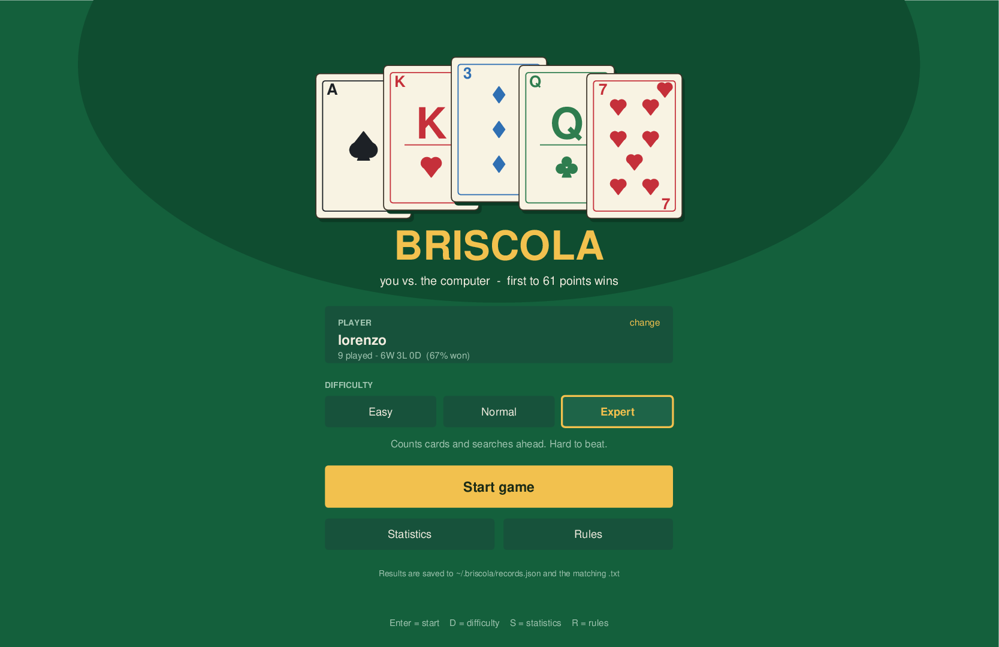
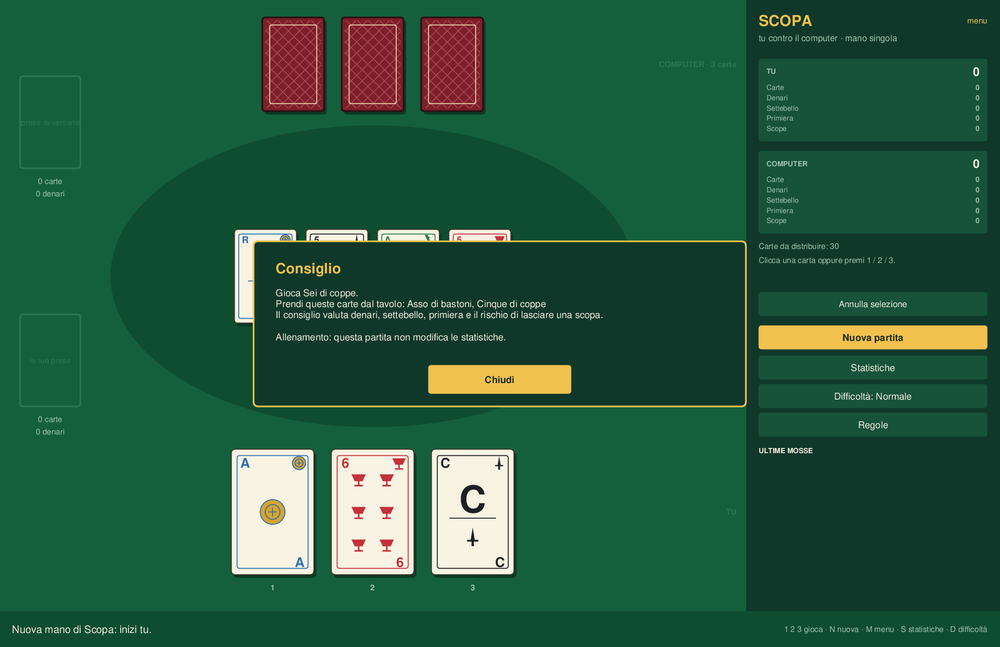
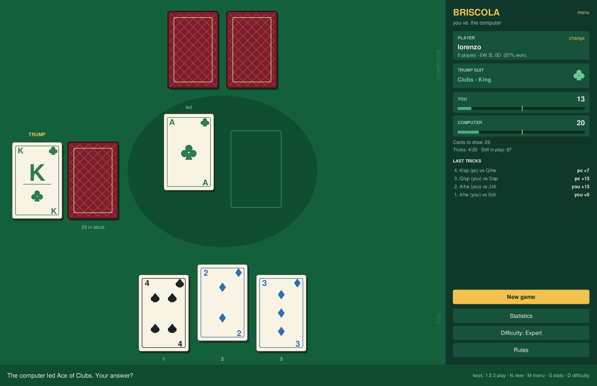
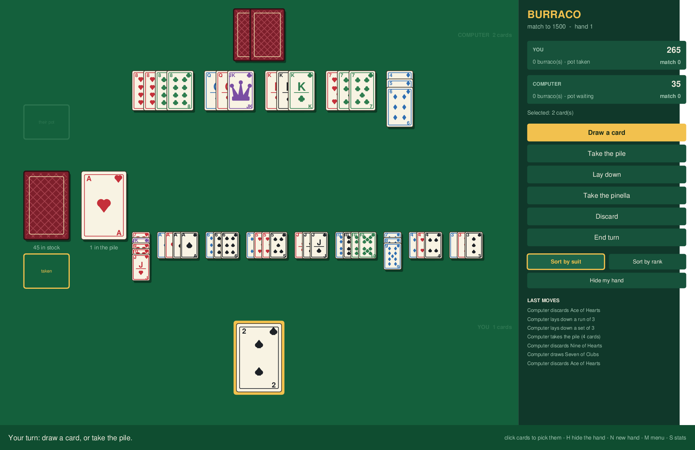
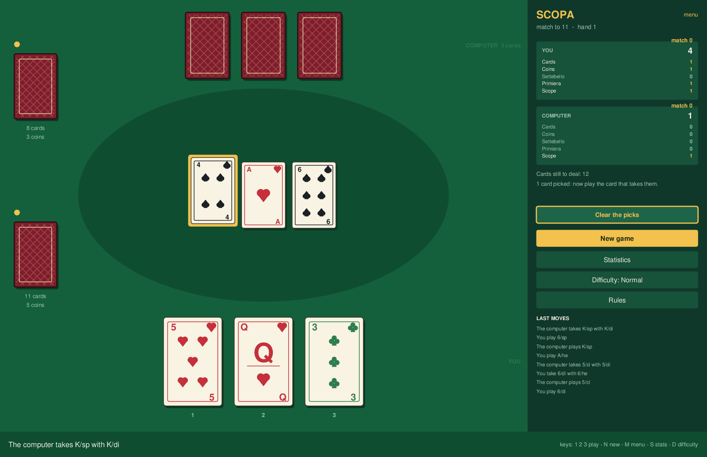
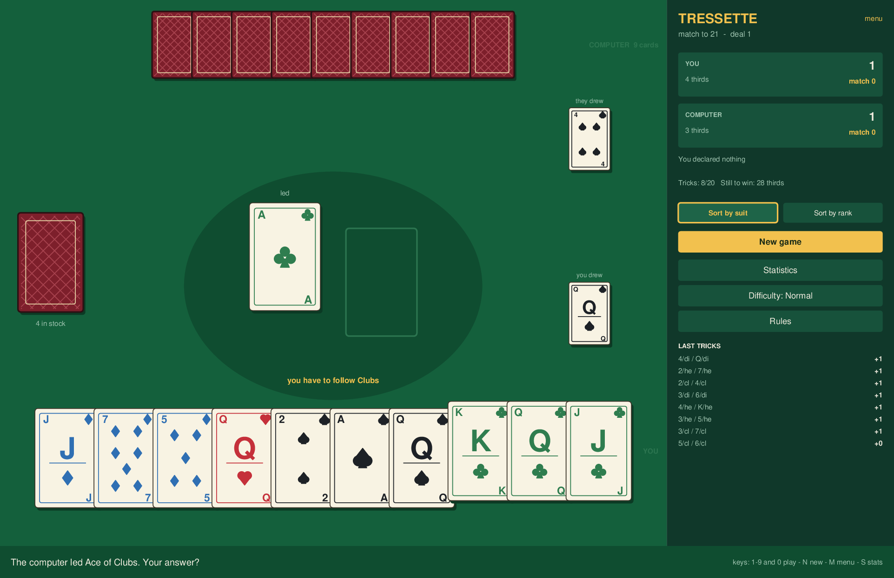
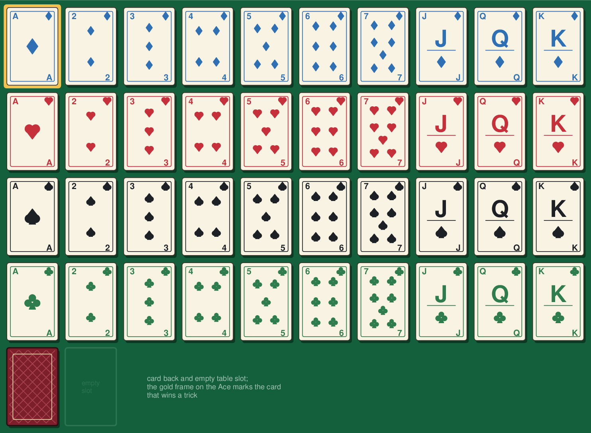
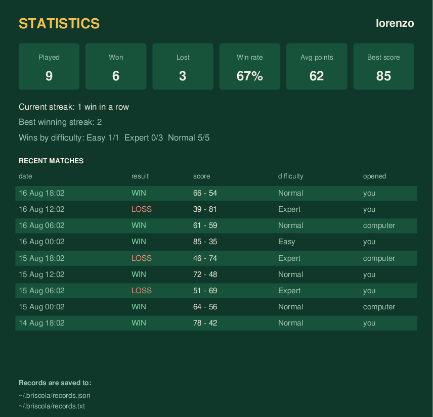

# Card games

Four Italian card games against the computer, in one Tkinter window:
**Briscola**, **Burraco**, **Scopa** and **Tressette**. Every card is drawn by
the code, so there are no image assets to install, and each game table is drawn on a single Canvas, with a shared toolbar
for resuming games, training and settings.



## Contents

- [Install and run](#install-and-run)
- [macOS application build](#macos-application-build)
- [The menu](#the-menu)
- [Resume, training and preferences](#resume-training-and-preferences)
- [Briscola](#briscola)
- [Burraco](#burraco)
- [Scopa](#scopa)
- [Tressette](#tressette)
- [The cards](#the-cards)
- [Match records](#match-records)
- [Pacing and performance](#pacing-and-performance)
- [Project layout](#project-layout)
- [Tests](#tests)
- [Continuous integration](#continuous-integration)
- [Screenshots](#screenshots)
- [Ideas for later](#ideas-for-later)

## Install and run

The project runs in its own conda environment named `briscola`, not in the base
environment:

```bash
conda env create -f environment.yml
```

Then:

```bash
conda run -n briscola python main.py
```

The window sizes itself to the screen: everything is drawn at one design size
and the canvas is scaled to whatever fits, between 0.65 and 1.7 of it. On a
1710x1112 screen that gives a 1500x971 window; on a 1280x800 laptop, 1019x660.

Nothing outside the standard library is required — only Python 3.10+ (for the
`X | None` type syntax) and Tk, both provided by the environment file.

## macOS application build

The repository includes a separate **macOS package** workflow. From GitHub,
open Actions → `macOS package` → `Run workflow`; it builds `CardGames.app`,
checks the bundle and uploads `CardGames-macOS.zip` as a downloadable artifact.
Pushing a version tag such as `v1.0.0` runs the same build automatically.

The package is unsigned, so macOS may ask you to confirm it in Privacy &
Security the first time it is opened. Records, preferences and resumable games
are still stored in the user's `~/.briscola/` directory, just as they are when
running from the conda environment.

The current replay file is stored as `last-replay.json`. It contains only public
move descriptions and card names already exposed on the table; it never stores
the opponent's hidden hand or the unseen stock.

## The menu

The app opens on a menu. Pick the game, pick the player the results are filed
under, pick the difficulty, and start. `Statistics` and `Rules` are reachable
from here too, and the `menu` link at the top of the side panel brings you back
during a game. Unfinished games are saved for resumption, and are not recorded
as completed matches.

| Action | How |
| --- | --- |
| Start | `Start game`, or Enter |
| Change game | The pills under `GAME`, or the menu |
| Change difficulty | The pills under `DIFFICULTY`, or `D` |
| Statistics | `Statistics`, or `S` |
| Rules | `Rules`, or `R` |
| Change player name | The `change` link in the player box |

## Resume, training and preferences



The toolbar above the table provides **Resume game**, **Hint**, **Review** and
**Settings**. Settings lets you select **Italiano / English**, animation speed
(slow, normal or fast) and French or stylised Italian suits. The Italian deck
maps diamonds to coins, hearts to cups, spades to swords and clubs to batons;
face labels become F/C/R. This changes the artwork, not the rules or deck size.

Language, speed, deck, game, difficulty, target and hand ordering are saved to
`preferences.json` alongside the records. English and French suits remain the
defaults for existing users.

An unfinished game is saved automatically after state changes and on exit to
`session.json` in the same directory. **Resume game** restores the player, exact
hands, stock, scores, pot/meld state, turn and match progress for all four games.
It also supports resuming between hands. There is one resume slot: starting a
new game replaces it. Finishing a match clears it. The file is versioned JSON;
invalid saves are reported and cannot execute code.

**Hint** suggests a legal action and explains the heuristic. It uses the human
player's cards and public information; it does not inspect hidden cards. A match
in which a hint is requested becomes a training match and is excluded from the
competitive records, including subsequent hands. A fresh match resets this flag.
**Review** shows the last completed trick in Briscola/Tressette and recent moves
in Scopa/Burraco. It does not undo moves or reveal hidden draws.

**Tutorial** opens a short three-step lesson for the selected game. It can be
opened from the menu or the table and never modifies a match or its records.

Statistics starts filtered to the selected game. Use the game and difficulty
selectors to narrow the results or choose **All games** for the overall record.
Average and best points are omitted from that aggregate because the games use
different scoring scales. Recent matches identify which game was played.

## Briscola



Trick taking with 40 cards: 20 tricks, 120 points in total, **61 points win**,
and 60–60 is a draw. Full rules: [Wikipedia](https://en.wikipedia.org/wiki/Briscola).

- Point values: Ace 11, Three 10, King 4, Queen 3, Jack 2, everything else 0.
- Strength within a suit: `A > 3 > K > Q > J > 7 > 6 > 5 > 4 > 2`.
- **Following suit is not required.** The responder only wins by playing a
  stronger card of the same suit, or a trump against a non-trump lead;
  otherwise the trick goes to the player who led.
- The trick winner draws first, then the opponent, and leads the next trick.
  The face-up trump card sits at the bottom of the stock, so it is drawn last.

| Action | How |
| --- | --- |
| Play a card | Click it, or press `1`, `2`, `3` |
| Carry on through a pause | Click anywhere, or press space |
| New game | `New game`, or `N` — the opening lead alternates each game |

### Difficulty

| Level | How it plays |
| --- | --- |
| **Easy** | Mostly random, but it will take an obviously valuable trick. |
| **Normal** | Classic heuristics: lead your cheapest card, duck small tricks, spend a trump only when the trick pays for it. |
| **Expert** | Counts cards and searches. Hard to beat. |

The Expert level works on two fronts. It tracks every card it has seen, so as
soon as nothing unknown is left to draw it can deduce the opponent's hand
exactly, and from there it solves the remaining tricks by exhaustive minimax —
if it can still reach 61, it will. Before that it deals the unseen cards into
many plausible opponent hands, plays every candidate card out in each of those
worlds, and keeps the card that wins the most of them (perfect information
Monte Carlo, the standard strong approach for trick-taking games).

Measured over the same deals played from both seats, so neither side gets the
better cards:

| Match-up | Score share of the stronger level | Games |
| --- | --- | --- |
| Normal vs Easy | 58% | 160 |
| Expert vs Normal | **76%** | 96 |
| Expert vs Easy | **83%** | 96 |

## Burraco



Melds, wild cards and the pot, with two 54-card decks — 108 cards. Full rules:
[Wikipedia](https://en.wikipedia.org/wiki/Buraco).

Both players get eleven cards, two pots (*pozzetti*) of eleven are set aside,
and the rest is the stock. On your turn you draw — one card from the stock, or
the whole discard pile — then lay down or extend as many melds as you like, and
finish by discarding one card.

- **Melds** are sets of the same rank, or runs in one suit, of at least three
  cards. An ace runs either below the two or above the king.
- **Wild cards** (*pinelle*) are the jokers and the twos, one per meld at most.
  A two of the run's own suit can serve as itself instead.
- A meld of seven cards or more is a **burraco**: 200 points clean, 100 with a
  wild card in it.
- Running out of cards the first time earns you the pot. After that, running
  out **closes** the hand — which needs a burraco, so any other move that would
  empty your hand is refused.
- Card points: joker 30, two 20, ace 15, K/Q/J/10/9/8 10, 7 down to 3 five.
  Melded cards count for you, cards left in hand count against you, and closing
  is worth 100. A pot you never took costs 100 — and so does one that came too
  late to play, instead of the eleven cards it brought.

| Action | How |
| --- | --- |
| Pick cards | Click them; click again to put one back |
| Draw / take the pile | The two buttons at the top of the panel |
| Lay down a meld | Pick the cards, then `Lay down` |
| Add to a meld | Pick the cards, then click the meld itself |
| Take a pinella back | Pick the card it stands for, then `Take the pinella` |
| Discard | Pick one card, then `Discard` |
| Sort your hand | `Sort by suit` or `Sort by rank` |
| Put the hand away | `Hide my hand`, or `H` |
| Start a fresh match | `New game`, or `N` |

The hand is put back in the chosen order after every draw, every pile taken and
every meld laid down, and wild cards sort to the end where they are easy to
find and hard to discard by accident.

A Burraco hand grows: eleven cards, plus a pot of eleven, plus whatever a
taken discard pile adds. The fan tightens as it fills so that it always fits
the table, with a clear margin at both ends — at a fixed spacing, seventeen
cards already spanned 1010 pixels of a 940 pixel table and the ones on the
ends could be neither seen nor clicked. Past twenty-five cards, tightening
alone is not enough and the hand scrolls instead, with the mouse wheel or the
arrows at either end.

Melds stay inside their own band of the table: the cards shrink as the row
fills so that a tableful never reaches down over the hand, where it could be
neither read nor added to. Shrinking is only the fallback, though — with many
melds it makes them hard to read, so **the hand can be put away** and the melds
take the lower table at full size. Sixteen melds are drawn at two thirds with
the hand out, and full size with it hidden.

Melds keep the order they are meant to be read in. A run reads along the
sequence with the wild card sitting in the hole it fills — `5 · joker · 7`, not
`5 · 7 · joker` — and cards added later are folded into place rather than tacked
on the end. Runs are drawn standing up and sets lying down, so the two are
told apart at a glance.

Clicking a meld only ever adds to it: buying the wild card back is a move of
its own, on its own button.

### Matches

A hand of Burraco is usually one of several. The menu picks what a match is
played to — 1000, 1500 or 2000 points, or a single hand — and hands are dealt
one after another until someone passes the target **and is ahead**: arriving
level settles nothing, so the match carries on into another hand. The panel
carries the running totals beside each hand score, and the statistics record
the match rather than each hand of it.

The opponent has two levels, Easy and Normal. It takes its own pinelle back
when it holds the natural card, picks melds by what they are worth on the
table rather than by how long they are, and decides whether the discard pile
is worth taking by how much more the hand could lay down with it — not by how
many cards look handy, which is a rule that reads its own hand size and runs
away with itself.

There is no expert level, and the omission is deliberate. Several were tried
and measured against Normal over eighty hands apiece, each deal played from
both seats: keeping the pinelle back for burracos, holding cards the opponent
could use, growing the longest meld first, and taking the pile more boldly.
The first three lost outright; the last gained points, 51%, while losing
matches 34-46, because a player who hoards material stops closing. Briscola's
expert works by searching sampled worlds, and that does not carry over —
Burraco has far more moves per turn and far longer hands.

## Scopa



The same forty cards as Briscola. Four go face up on the table and each player
gets three; three more come out when both hands are empty, until the deck is
spent. Full rules: [Wikipedia](https://en.wikipedia.org/wiki/Scopa).

- Play a card and it **takes** the table card of the same value. Only if no
  single card matches may it take several that **add up** to it — that
  obligation is the whole game, and it is why leaving a seven out is safer
  than leaving a three and a four.
- Face cards count 8, 9 and 10. A card that takes nothing stays on the table.
- Clearing the table is a **scopa**, worth a point — except on the very last
  card of the hand, which clears a table nobody could have played on.
- When the deck runs out, whoever captured last takes what is still there.

Then four points are settled: most **cards**, most **coins** (diamonds stand in
for denari, as the queen stands in for the cavallo), the **settebello** (the
seven of coins), and the **primiera** — your best card in each suit, counting
7=21, 6=18, A=16, 5=15, 4=14, 3=13, 2=12 and faces 10. A count that ends level
scores for nobody. Every scopa is a point on top.

| Action | How |
| --- | --- |
| Play a card | Click it, or press `1` / `2` / `3` |
| Choose between takes | Click the table cards you want, then play the card |
| Undo the picks | `Clear the picks` |
| New match | `New game`, or `N` |

Most of the time there is only one legal take and the click is all it needs.
When there are several — two cards of the same value on the table, or more than
one set that adds up — the window says so and waits, rather than choosing for
you.

### Difficulty

| Level | How it plays |
| --- | --- |
| **Easy** | Takes whatever it happens to pick. |
| **Normal** | Weighs what a take is worth against what the play leaves behind. |
| **Expert** | Deals out the cards it cannot see and plays the hand out. |

Normal prices every capture — cards, coins, the settebello, a rough primiera —
and then subtracts what the move leaves on the table, scaled by the chance the
other side is holding something that clears it. Expert keeps that as its
playout policy but stops guessing: it deals the unseen cards into a couple of
dozen plausible worlds, plays each candidate move out to the end of the hand in
every one of them, and keeps the move with the best average score. A hand of
Scopa is short enough to sample multiple continuations within a bounded search.

Measured over the same deals played from both seats, judged on points:

| Match-up | Score share of the stronger level | Hands |
| --- | --- | --- |
| Normal vs Easy | **69%** | 600 |
| Expert vs Normal | **57%** | 320 |
| Expert vs Easy | **70%** | 240 |

Expert beats Normal clearly, but hardly pulls further ahead of Easy than Normal
does: a hand is only worth four points plus the scope, so there is a ceiling on
how much of it any opponent can take.

### Matches

Like Burraco, Scopa is played as a series. The menu picks the target — 11, 16
or 21, or a single hand — and hands are dealt until someone passes it **and is
ahead**.

## Tressette



The same forty cards again, and **no trump suit at all**. Ten cards each and
twenty face down as the stock; the highest card of the suit led takes the
trick, the winner draws first and leads the next one. Full rules:
[Wikipedia](https://en.wikipedia.org/wiki/Tressette).

- Order inside a suit: **3 > 2 > A > K > Q > J > 7 > 6 > 5 > 4**. An ace is a
  big card that two smaller-looking ones beat, which is most of the game.
- **Following suit is compulsory.** Cards you may not play are drawn shaded
  and sitting lower than the rest, so the rule shows before you click rather
  than after.
- Both draws are face up: with a stock this small, what the other side picked
  up is part of what either player is entitled to count.

Points are counted in **thirds**: the ace is worth three, the two, the three
and the three faces one each, the rest nothing, and the last trick three more.
Each side divides its own thirds by three and throws the remainder away, which
is why a deal is worth eleven points and not eleven and two thirds.

Declared from the hand as it is dealt, before a card is played: the ace, two
and three of one suit is a **napoletana**, worth 3; three aces, twos or threes
is worth 3, and four of them 4. A card can serve in both — three aces and a
napoletana score six between them.

| Action | How |
| --- | --- |
| Play a card | Click it, or press `1`–`9` and `0` for the tenth |
| Sort your hand | `Sort by suit` or `Sort by rank` |
| Skip a pause | Click the table, or space |
| New match | `New game`, or `N` |

Ten cards want ordering, so the hand is sorted from the deal and a card drawn
mid-deal slots into place rather than landing on the end. `Sort by rank` means
this game's order and not the number on the card: a hand sorted by number
would stand the three next to the four and put the ace between the two and the
king, which is exactly backwards.

### Difficulty

| Level | How it plays |
| --- | --- |
| **Easy** | Plays any card the rules allow. |
| **Normal** | Knows which card commands a suit, and spends nothing it need not. |
| **Expert** | Deals out the cards it cannot see and plays the deal out. |

Normal asks two questions of every card: does anything still out there beat it
in its own suit, and what does playing it cost. That is enough to lead a
commanding card, duck a trick worth nothing, and take one worth thirds with the
cheapest card that does it. Expert keeps that as its playout policy and stops
guessing at the rest: it deals the unseen cards into twenty worlds, plays each
candidate card to the end of the deal in every one, and keeps the best average.
The search runs asynchronously; see the timing sample below.

Measured over the same deals played from both seats and both leads, judged on
thirds:

| Match-up | Share of the thirds | Deals |
| --- | --- | --- |
| Normal vs Easy | **66%** | 400 |
| Expert vs Normal | **64%** | 120 |
| Expert vs Easy | **67%** | 100 |

### Matches

A deal is worth eleven points, so a match is played to 21 or 31 — or a single
deal, if you would rather. As in the other two, the target has to be passed
**and** the lead held: arriving level plays another deal.

## The cards



Every card is drawn with canvas primitives — no image files, and sharp at any
size: traditional pip layouts for the numerals, a letter plus a pip for the
face cards, and the four French suits built from ovals and polygons rather than
unicode glyphs, which do not survive the PostScript export the screenshots go
through. The joker is a jester's cap.

Briscola plays a French deck with the 8s, 9s and 10s removed, which is how it
is often played in Italy: the remaining 40 cards match an Italian deck one for
one, with the queen standing in for the cavallo. Burraco uses both full decks.

Each suit gets its own colour instead of the usual red and black. Two suits
sharing a colour is fine when you hold thirteen cards and have time; here you
read a hand in a moment, and a glance at the colour is quicker than a glance at
the shape. Set `SUIT_COLORS = TWO_COLOUR` in `cardgames/cardart.py` for the
traditional red and black, or `STYLE = "minimal"` for faces with no pips.

## Match records

Every finished game is recorded against a player name (your system user name by
default), for either game. Records are written to **two files**, side by side:

- `~/.briscola/records.json` — the structured store the app reads back.
- `~/.briscola/records.txt` — a plain-text log, one line per match, appended as
  you play, so the history stays readable without the app:

```
# Card games match log
# date time        player           game      result   you -  ai   settings
2026-08-18 15:02  lorenzo          briscola  WIN        73 - 47    difficulty=normal opened=you
2026-08-18 15:19  lorenzo          burraco   LOSS      585 - 835   difficulty=normal opened=computer
```

Both paths can be redirected with the `BRISCOLA_RECORDS` and
`BRISCOLA_RECORDS_TXT` environment variables, which is what the tests use.



An interrupted game is never recorded — only a finished one is.

## Pacing and performance

Briscola pauses twice per trick — before the computer plays, and again on the
finished trick so you can see what it won — because otherwise cards appear and
vanish faster than you can read them. **Clicking the table or pressing space
carries on immediately**: at normal speed, 550 ms and 1000 ms if you let them run, nothing if you
don't. During your own turn a click on a card only ever plays that card.

Which card a click or the hover lift refers to is worked out from the pointer
position against the fixed slot geometry, never from where the card image
currently sits. That matters more than it sounds: the obvious implementation,
Tk's per-item `<Enter>`/`<Leave>`, deadlocked the window. Lifting a card moved
it out from under a pointer resting near its bottom edge, Tk sent `<Leave>`,
the card dropped back under the pointer, `<Enter>` fired, and the two chased
each other at full CPU while real clicks were never processed.

Expert search timing, measured over ten seeded initial positions on the
development machine (September 2026):

| Level | Mean | Maximum in sample |
| --- | --- | --- |
| Briscola Expert | 124 ms | 125 ms |
| Scopa Expert | 278 ms | 387 ms |
| Tressette Expert | 609 ms | 658 ms |

Expert decisions now run on a **worker thread with a copy of the game state**.
The Tk thread polls for the result and applies it only if the same game is still
active. Returning to the menu, starting a new game or closing the window invalidates
pending results. Workers never call Tk or mutate the live game.

Search budgets remain 120 ms for Briscola and 900 ms for Scopa/Tressette, checked
between batches of sampled worlds. They are soft limits, not strict maximum
latencies; all three searches use a monotonic clock. Easy and Normal keep their
existing synchronous path.

For a repeatable timing sample, run `python tools/benchmark_ai.py --samples 10`.
These are search times, not UI stalls or guarantees for every game position.

Idle — on the menu or waiting for your card — the process measures **0.2% CPU
and about 78 MB resident**. If the interface ever misbehaves, run it with
`BRISCOLA_DEBUG=1` and it traces every turn, click, timer and opponent decision
to stdout; exceptions inside a callback are printed and shown in the status bar
rather than swallowed.

## Project layout

| Path | Contents |
| --- | --- |
| `main.py` | Entry point |
| `cardgames/cards.py` | Cards and decks, shared: real ranks 1–13, jokers |
| `cardgames/cardart.py` | Card drawing on a Canvas |
| `cardgames/records.py` | Per-player records with game/difficulty filters |
| `cardgames/statistics.py` | Statistics rendering |
| `cardgames/session.py` | Validated, versioned JSON game snapshots |
| `cardgames/preferences.py` | Persistent language, speed, deck and game settings |
| `cardgames/i18n.py` | Italian text, rules and presentation translation |
| `cardgames/training.py` | Explainable hints using player-visible information |
| `cardgames/ui.py` | Palette, window geometry, and the list of games |
| `cardgames/match.py` | The running score of a series of hands, shared |
| `cardgames/app.py` | Shared application window and game flow |
| `cardgames/features.py` | Resume, settings, training and asynchronous AI coordination |
| `cardgames/briscola/` | Rules, AI, layout and `view.py`; `gui.py` retains import compatibility |
| `cardgames/burraco/` | `engine.py` rules, `ai.py` opponent, `layout.py` geometry, `view.py` table |
| `cardgames/scopa/` | `engine.py` rules, `ai.py` opponent, `layout.py` geometry, `view.py` table |
| `cardgames/tressette/` | `engine.py` rules, `ai.py` opponent, `layout.py` geometry, `view.py` table |
| `cardgames/catalog.py` | Shared game metadata: rules, levels, targets and controls |
| `tools/screenshots.py` | Regenerates the images in `docs/` |
| `tests/` | See below |

No game's rules import Tkinter, so they can be tested and reused without an
interface. The geometry is separate again: `layout.py` is plain arithmetic,
which is why most of what used to need a window does not any more.

## Tests

No test framework needed — each file runs standalone:

```bash
conda run -n briscola python tests/test_burraco.py
```

| File | Tests | Time | Covers |
| --- | --- | --- | --- |
| `test_features.py` | 8 | < 1 s | Save round trips, corrupted saves, preferences, filtered stats and fair hints |
| `test_features_gui.py` | 11 | a few seconds | Resume, training, settings, filters and worker cancellation |
| `test_catalog.py` | 3 | < 0.1 s | Shared metadata for all games and menu configuration |
| `test_layout.py` | 40 | 0.05 s | Table geometry for all four games, with no window at all |
| `test_records.py` | 7 | 0.05 s | The json store and the text log |
| `test_burraco.py` | 70 | 4 s | Burraco rules, melds, wild cards, scoring, the opponent |
| `test_scopa.py` | 59 | 11 s | Scopa rules, taking, the scope, the four points, the opponent |
| `test_tressette.py` | 32 | 7 s | Tressette order, the suit obligation, thirds, declarations |
| `test_engine.py` | 8 | 18 s | Briscola rules and the relative strength of the levels |
| `test_gui.py` | 53 | 28 s | The window: event routing, turns, records |

`test_gui.py` drives the interface with real Tk mouse events, including whole
hands of Burraco, Scopa and Tressette played only by clicking real controls. Its windows
are parked off screen so they neither steal focus nor catch a stray click.

## Continuous integration

Every push to `main` and every pull request runs the display-free suite on
Ubuntu, macOS and Windows with Python 3.10, 3.11 and 3.12. The workflow checks
whitespace and Python syntax before running the tests through
`tools/ci_tests.py`.

The Tk tests remain separate because they need a real desktop session. Run them
locally with:

```bash
conda run -n briscola python tests/test_gui.py
conda run -n briscola python tests/test_features_gui.py
```

Each file runs as many tests as it defines — worth checking, since appending a
test below the `if __name__ == "__main__"` block that runs them means it never
runs at all, and the suite reports all green without it:

```bash
for f in tests/*.py; do
  echo "$f: $(grep -c '^def test_' $f) defined, $(conda run -n briscola python $f | grep -c '^ok') ran"
done
```

## Screenshots

The images in `docs/` are generated from the real code — the interface is one
Canvas, which is exported to PostScript and converted to PNG with Ghostscript:

```bash
conda run -n briscola python tools/screenshots.py
```

This needs `gs` on the path (`brew install ghostscript` on macOS). Each image is
rendered in its own process, because opening several Tk roots in one process is
flaky on macOS.

## Ideas for later

- Burraco for four players in two pairs, which is how it is usually played.
- Scopa for four, and Scopone, which is the same game with the whole deck dealt.
- Scopa's optional points: the napola, and the re bello.
- Tressette for four in two pairs, where the signals between partners are the
  whole game; and declaring a combination drawn from the stock, rather than
  only from the hand as it is dealt.
- A cap on how far a long row of melds may spread down the table.
- Best-of-three Briscola with a running aggregate score.
- A leaderboard across players in the statistics window.
